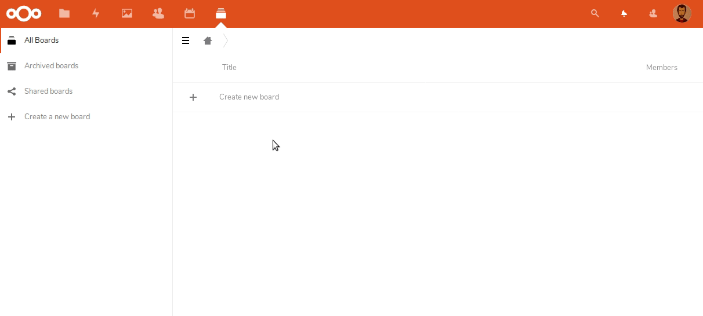
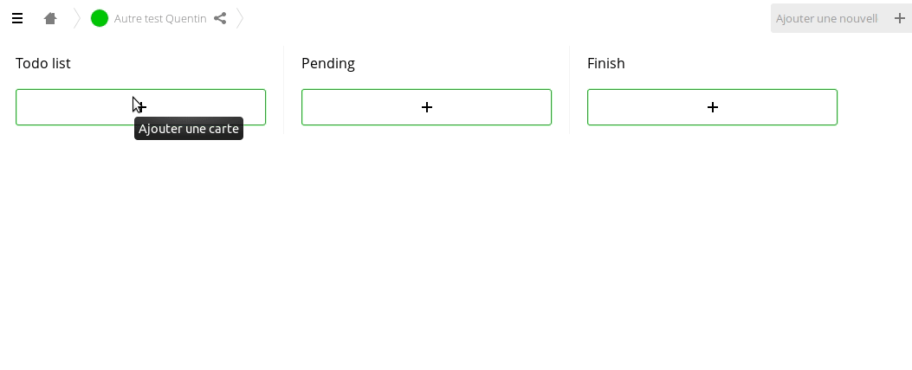
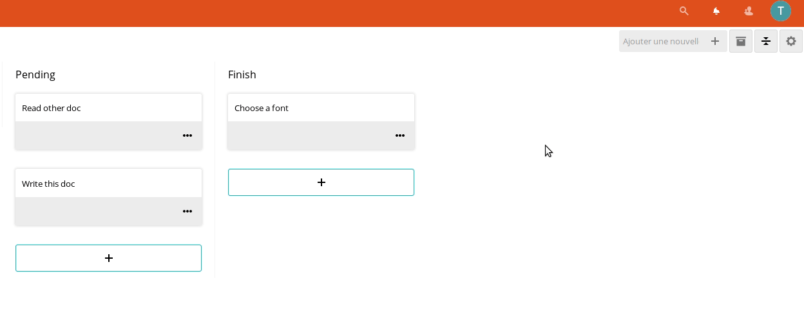
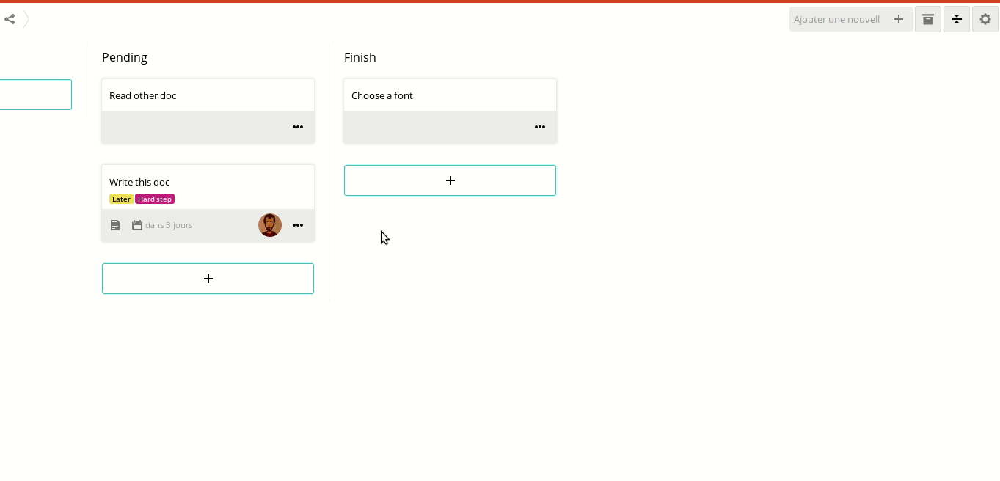
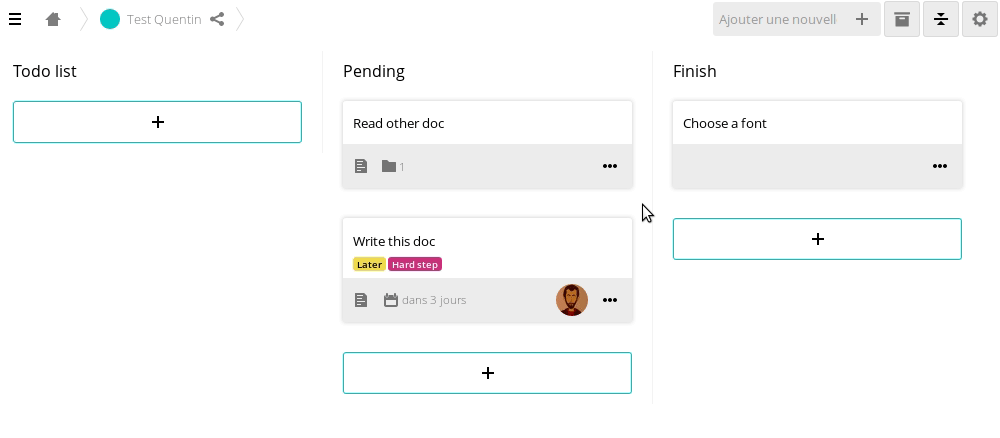

## Introduction
### What about Deck ?
You may know Kanban website like Trello? Deck is about the same thing but secured and respectful of your privacy!  
Integrated in Nextcloud, you can easily manage your projects while having your data secured.

### Use cases
Project management, time management or ideation, Deck makes it easier for you to manage your work.

## Using Deck
Overall, Deck is easy to use. You can create boards, add users, share the Deck, work collaboratively and in real time.

- 1. [Create my first board](#1-create-my-first-board)
- 2. [Create stacks and cards](#2-create-stacks-and-cards)
- 3. [Handle cards options](#3-handle-cards-options)
- 4. [Archive old tasks](#4-archive-old-tasks)
- 5. [Manage your board](#5-manage-your-board)
- 6. [Import boards](#6-import-boards)
  - [Trello JSON](#trello-json)
  - [Trello API](#trello-api)

### 1. Create my first board
In this example, we're going to create a board and share it with an other nextcloud user.




### 2. Create stacks and cards
Stacks are simply columns with list of cards. It can represent a category of tasks or an y step in your projects for example.   
**Check this out :**


What about the cards? Cards are tasks, objects or ideas that fit into a stack. You can put a lot of cards in a stack! An infinity? Who knows! Who knows!   

And all the magic of this software consists on moving your cards from a stack to an other.  
**Check this out :**



### 3. Handle cards options
Once you have created your cards, you can modify them or add options by clicking on them. So, what are the options? Well, there are several of them:

- Tag Management
- Assign a card to a user (s·he will receive a notification)
- Render date, or deadline



And even :

- Description in markdown language
- Attachment - *you can leave a document, a picture or some other bonus like that.*



### 4. Archive old tasks
Once finished or obsolete, a task could be archived. The tasks is not deleted, it's just archived, and you can retrieve it later



### 5. Manage your board
You can manage the settings of your Deck once you are inside it, by clicking on the small wheel at the top right.
Once in this menu, you have access to several things:

- Sharing
- Tags
- Deleted objects
- Timeline

The **sharing tab** allows you to add users or even groups to your boards.  
**Tags** allows you to modify the tags available for the cards.  
**Deleted objects** allows you to return previously deleted stacks or cards.  
The **Timeline** allows you to see everything that happened in your boards. Everything!

### 6. Import boards

Importing can be done using the API or the `occ` `deck:import` command.

It is possible to import from the following sources:

#### Trello JSON

Steps:
* Create the data file
  * Access Trello
  * go to the board you want to export
  * Follow the steps in [Trello documentation](https://help.trello.com/article/747-exporting-data-from-trello-1) and export as JSON
* Create the configuration file
* Execute the import informing the import file path, data file and source as `Trello JSON`

Create the configuration file respecting the [JSON Schema](https://github.com/nextcloud/deck/blob/master/lib/Service/fixtures/config-trelloJson-schema.json) for import `Trello JSON`

Example configuration file:
```json
{
    "owner": "admin",
    "color": "0800fd",
    "uidRelation": {
        "johndoe": "johndoe"
    }
}
```

**Limitations**:

Importing from a JSON file imports up to 1000 actions. To find out how many actions the board to be imported has, identify how many actions the JSON has.

#### Trello API

Import using API is recommended for boards with more than 1000 actions.

Trello makes it possible to attach links to a card. Deck does not have this feature. Attachments and attachment links are added in a markdown table at the end of the description for every imported card that has attachments in Trello.

* Get the API Key and API Token [here](https://developer.atlassian.com/cloud/trello/guides/rest-api/api-introduction/#authentication-and-authorization)
* Get the ID of the board you want to import by making a request to:
https://api.trello.com/1/members/me/boards?key={yourKey}&token={yourToken}&fields=id,name

  This ID you will use in the configuration file in the `board` property
* Create the configuration file

Create the configuration file respecting the [JSON Schema](https://github.com/nextcloud/deck/blob/master/lib/Service/fixtures/config-trelloApi-schema.json) for import `Trello JSON`

Example configuration file:
```json
{
    "owner": "admin",
    "color": "0800fd",
    "api": {
        "key": "0cc175b9c0f1b6a831c399e269772661",
        "token": "92eb5ffee6ae2fec3ad71c777531578f4a8a08f09d37b73795649038408b5f33"
    },
    "board": "8277e0910d750195b4487976",
    "uidRelation": {
        "johndoe": "johndoe"
    }
}
```

## Search

Deck provides a global search either through the unified search in the Nextcloud header or with the inline search next to the board controls.
This search allows advanced filtering of cards across all board of the logged in user.

For example the search `project tag:ToDo assigned:alice assigned:bob` will return all cards where the card title or description contains project **and** the tag ToDo is set **and** the user alice is assigned **and** the user bob is assigned.

### Supported search filters

| Filter      | Operators         | Query                                                        |
| ----------- | ----------------- | ------------------------------------------------------------ |
| title       | `:`               | text token used for a case-insentitive search on the cards title |
| description | `:`               | text token used for a case-insentitive search on the cards description |
| list        | `:`               | text token used for a case-insentitive search on the cards list name |
| tag         | `:`               | text token used for a case-insentitive search on the assigned tags |
| date        | `:`               | 'overdue', 'today', 'week', 'month', 'none'                  |
|             | `>` `<` `>=` `<=` | Compare the card due date to the passed date (see [supported date formats](https://www.php.net/manual/de/datetime.formats.php)) Card due dates are always considered UTC for comparison |
| assigned    | `:`               | id or displayname of a user or group for a search on the assigned users or groups |

Other text tokens will be used to perform a case-insensitive search on the card title and description

In addition wuotes can be used to pass a query with spaces, e.g. `"Exact match with spaces"` or `title:"My card"`.
